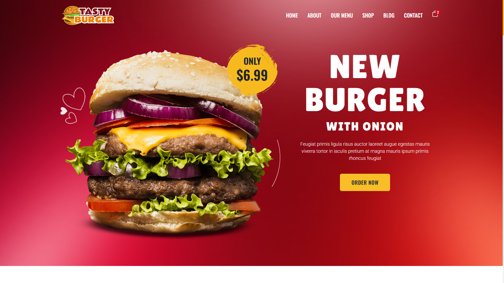
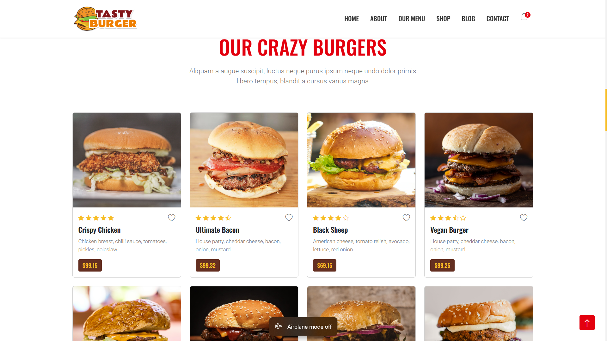

<div id="top"></div>

<div align="center">

# 🍴 FOOD DELIVERY APP  
*Order Delicious Meals Anytime, Anywhere*


*Built with the tools and technologies:*


</div>

---

## 📸 Screenshots

| Home Page | Menu Page | Cart Page |
| :--: | :--: | :--: |
|  |  |  |

---

## 📑 Table of Contents

- [Overview](#-overview)
- [Demo](#-demo)
- [Getting Started](#-getting-started)
  - [Prerequisites](#-prerequisites)
  - [Installation](#-installation)
  - [Usage](#-usage)

---

## 🧐 Overview  

**Food Delivery App** is a responsive web application built with **React** that allows users to browse menus, view promotions, add food items to their cart, and proceed with checkout.  
It is designed with a clean UI, smooth navigation, and mobile-first responsiveness.

---

## 🔗 Demo  

> Live Preview: [🍔 Food Delivery App Demo](https://your-live-demo-link.vercel.app/)  

---

## 🚀 Getting Started  

### ✅ Prerequisites  

- **Programming Language:** JavaScript  
- **Package Manager:** npm  

---

### ⚙️ Installation  

```bash
# Clone the repository
git clone https://github.com/Surya821/Food-Delivery-App

# Navigate to the project directory
cd Food-Delivery-App

# Install dependencies
npm install
```


---

## ▶️ Usage
Run the project locally with:
```
npm start
```

---

## 👨‍💻 Author  

**Surya Pratap Singh**  <br/>
🔗 Connect with me:  <br/>
- [LinkedIn](https://www.linkedin.com/in/your-linkedin-profile) <br/> 
- [GitHub](https://github.com/Surya821)  <br/>
- [GeeksforGeeks](https://auth.geeksforgeeks.org/user/your-gfg-profile)  <br/>
- [Portfolio Website](https://your-portfolio-link.com)  <br/>
